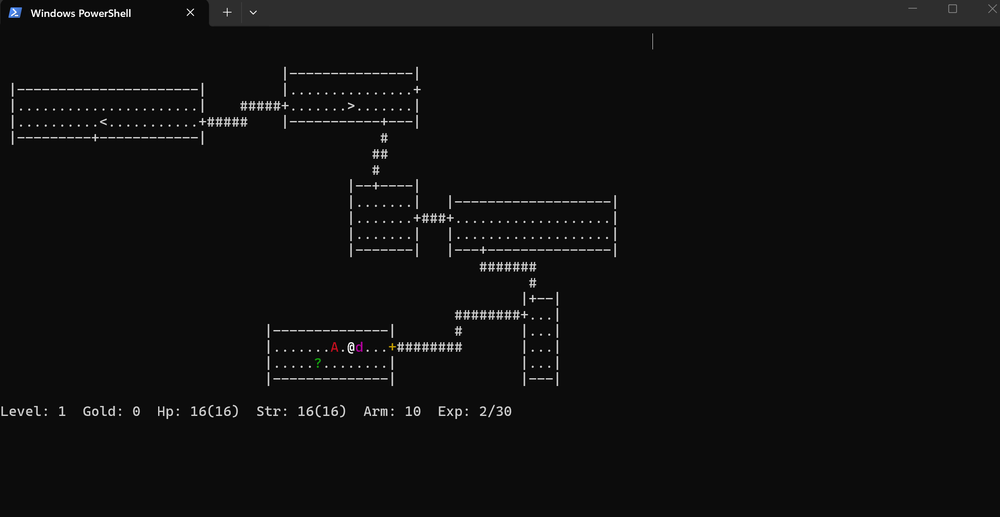

# rogi

A small terminal rogue game — a from-scratch recreation of the classic MS-DOS dungeon crawler *Rogue*, in Python with `curses`. Procedurally generated dungeons, permadeath, hunger clock, a full monster bestiary, and a pet dog that grows when you feed it.



## Contents

- [Docs](#docs)
- [Running it](#running-it)
- [Controls](#controls)
- [Goal](#goal)
- [The dog](#the-dog)
- [Implementation notes](#implementation-notes)

## Docs

- [Features](docs/features.md) — everything the game does
- [Ruleset](docs/ruleset.md) — stats, combat math, item odds, status effects, full A–Z bestiary
- [Roadmap](docs/roadmap.md) — gaps versus classic Rogue

## Running it

```
pip install windows-curses   # Windows only; curses is built-in on Linux/macOS
python main.py
```

Requires an 80x24 (or larger) terminal.

## Controls

| Key(s)          | Action                          |
|-----------------|----------------------------------|
| h/j/k/l, y/u/b/n, arrows | Move (bump a monster to attack) |
| `i`             | Show inventory                  |
| `w` / `W`       | Wield a weapon / wear armor      |
| `q` / `r`       | Quaff a potion / read a scroll   |
| `z`             | Zap a wand (then pick a direction) |
| `e`             | Eat food                         |
| `d`             | Drop an item (or feed the dog if standing next to it) |
| `>` / `<`       | Use stairs down / up             |
| `s` / `.`       | Search / wait a turn             |
| `?`             | Help screen                      |
| `Q`             | Quit (saves progress)            |

Items are picked up automatically by walking over them.

## Goal

Descend 26 procedurally generated dungeon levels, retrieve the Amulet of Yendor, and carry it back up to level 1 to win. Death is permanent — there's no reloading after you die.

## The dog

A dog spawns next to you at the start of the game and follows you (including through stairs). Stand next to it and drop a food item (`d`) to feed it — it grows from a small `d` into a big `D` and will fight monsters that come near it.

## Implementation notes

- **Dungeon generation** (`rogue/dungeon.py`): the map area is divided into a 3x3 grid of cells, each gets a randomly sized/positioned room. Rooms are connected with a randomized spanning tree over the 3x3 grid graph (plus a chance of extra edges for loops), and corridors are carved as L-shaped paths between doors punched through facing room walls.
- **Visibility** (`rogue/dungeon.py: Level.visible_from`): matches the original's room-based lighting rather than modern raycast FOV — standing in a room lights the whole room; standing in a corridor only lights your immediate surroundings. `Level.discovered` remembers tiles you've seen (drawn dim) even once they're out of the currently-lit set.
- **Turn loop** (`rogue/game.py: Game._end_turn`): every player action that consumes a turn triggers hunger decay, confusion/blindness countdowns, natural regen, the monster AI pass, and the dog's AI pass, in that order, then checks for player death.
- **Combat** (`rogue/combat.py`): a simplified to-hit/damage model (`45 + atk*5 - defender_ac*4` percent chance to hit, capped 5-95%) rather than the original's exact tables, since those internals weren't being reproduced verbatim.
- **Monsters** (`rogue/monsters_data.py`): 26 species, one per letter A-Z, with stats that scale roughly with letter/depth. Spawn selection (`Game._pick_species_index`) weights toward species near the current dungeon depth.
- **Unidentified items** (`rogue/items.py`): potion colors and scroll titles are shuffled onto effects at the start of each game (`make_appearance_maps`), so "blue potion" means something different every playthrough until identified by use or a scroll of identify.
- **The dog** (`rogue/entities.py: Dog`, `rogue/game.py: Game._dog_turn`): attacks any monster adjacent to it instead of moving; otherwise closes the gap whenever more than one tile from the player, and starts closing it the instant the player takes a step. Once caught up and the player is standing still, it roams freely around the room the player is in rather than sitting fixed at their side. Unkillable by design (no hp tracked) to keep it a simple companion rather than another thing to manage.
- **Permadeath & saves**: `Game.save()`/`Game.load()` pickle the whole game state to `save.dat`; the save is deleted on both death and victory, so there's no way to reload past either.
- **Traps** (`rogue/dungeon.py`, `Game._trigger_trap`): six trap types placed per level, hidden until sprung by stepping on them or spotted with `s` (search). Each trap fires once; a trap door drops you to the next level, the rest damage or afflict you in place.
- **Wands** (`rogue/items.py`, `Game._zap_wand`): a single item kind covering both "wands" and "staffs" from the original, since they're mechanically identical. Five effects, 3-7 charges each, identified by use. Zapping (`z`) fires a straight-line bolt in a chosen direction that resolves against the first monster it hits.
